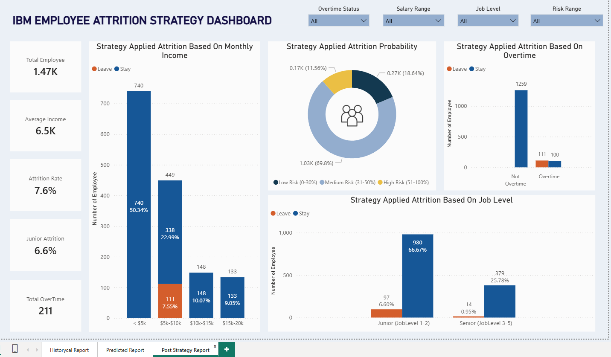

# IBM Employee Attrition Prediction & Strategy

**Reducing IBM staff turnover via data-driven, actionable HR interventions.**

---

## Executive Summary
IBM’s current attrition rate stands at **16.12%**. By leveraging machine learning to identify high-risk employees and simulating targeted retention strategies, this project successfully reduced the projected attrition rate to **7.6%**.

## Project Documentation
For a comprehensive overview of the research, methodology, and business impact of this project, you can review the full presentation:
* **Presentation**: [IBM Employee Attrition Strategy.pptx](IBM Employee Attrition Strategy.pptx)

---

## 🛠 Tech Stack & Tools
* **Data Collection & Preprocessing:** Microsoft Excel
* **Data Source**: [IBM HR Analytics Attrition Dataset (Kaggle)](https://www.kaggle.com/datasets/pavansubhasht/ibm-hr-analytics-attrition-dataset)
* **Database & Querying:** SQL (Structured Query Language)
* **Business Intelligence & Data Visualization:** Power BI

---

## 🛠 Technical Implementation

### 1. Data Cleaning & Feature Engineering
To ensure high-quality insights, the raw dataset underwent rigorous preprocessing:
* **Noise Reduction:** Automatically dropped columns with zero variance and mapped categorical text (e.g., "Yes"/"No") to numeric binary values (`1`/`0`) required for Logistic Regression.
* **Correlation-Driven Selection:** Performed a correlation analysis against the target `Attrition` variable to objectively identify the strongest statistical drivers of turnover.
* **Strategic Feature Engineering:** Beyond statistical correlations, we deliberately retained features like `JobLevel`, `PerformanceRating`, and `JobInvolvement`.

#### Why these features?
* **Model Accuracy:** By including the highest-correlated variables (`TotalWorkingYears`, `OverTime`, `MonthlyIncome`), the Logistic Regression model maximizes its predictive power.
* **Actionability:** Including `JobLevel` and `PerformanceRating` allows our model to simulate "What-If" scenarios, such as: *"If we increase the salary of high-performing junior staff, how much does our attrition risk drop?"*.

*View the full cleaning logic and feature selection here: [data_cleaning.py](data_cleaning.py)*

---

### 2. Predictive Modeling (Logistic Regression)
We utilized a **Logistic Regression** model to classify employees based on their flight risk.
* **Model Approach:** We employed `class_weight='balanced'` to ensure the model remained sensitive to the minority class (employees who leave), which historically makes up only ~16% of the workforce.
* **Strategy Simulation:** After calculating baseline risk, we applied custom HR policy functions to simulate the impact of policy changes (e.g., capping overtime for junior staff and adjusting compensation packages).

*View the full modeling and strategy simulation code here: [predictive_model.py](predictive_model.py)*

---

## 📊 Key Findings
* **Primary Drivers:** Overtime, Monthly Income, and Job Level are the most significant factors influencing turnover.

* 

* 

* **Impact of Overtime:** 53.59% of employees who left worked overtime; 100% of employees predicted to leave fall within the overtime group.
* **Projected Results:**
    * Overall attrition reduced from **16.1% to 7.6%**.
    * Junior staff (Job Levels 1-2) attrition rate decreased from **20.54% to 6.60%**.

*For a detailed look at the statistical KPIs, see: [attrition.sql](attrition.sql)*

---

## 🚀 Getting Started
1. **Clone the repository:** `git clone [your-repo-link]`
2. **Run Data Cleaning:** Execute `python data_cleaning.py` to process the raw dataset.
3. **Run Prediction Model:** Execute `python predictive_model.py` to generate the risk analysis and strategy simulation.
